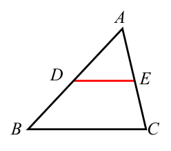
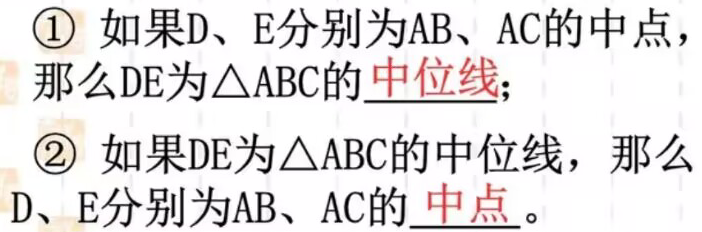
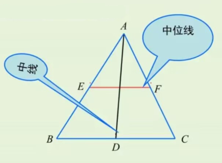
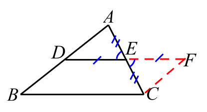
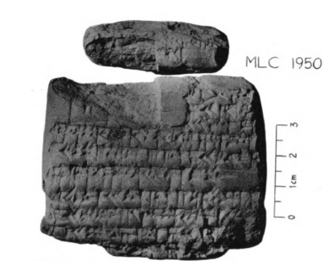
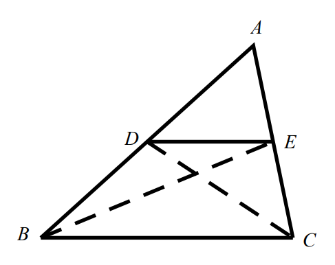
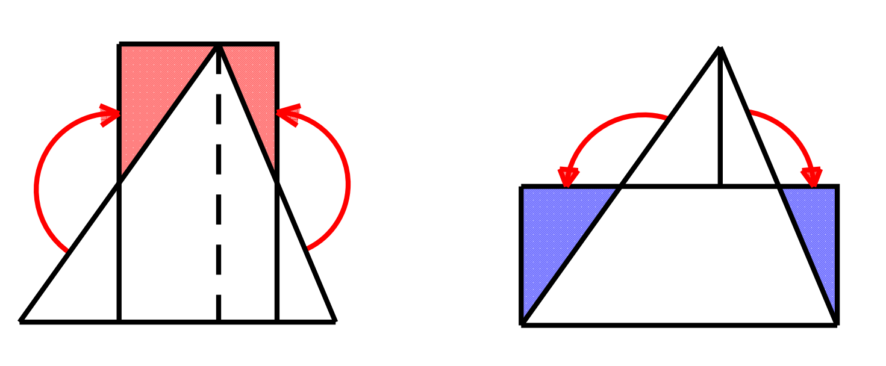
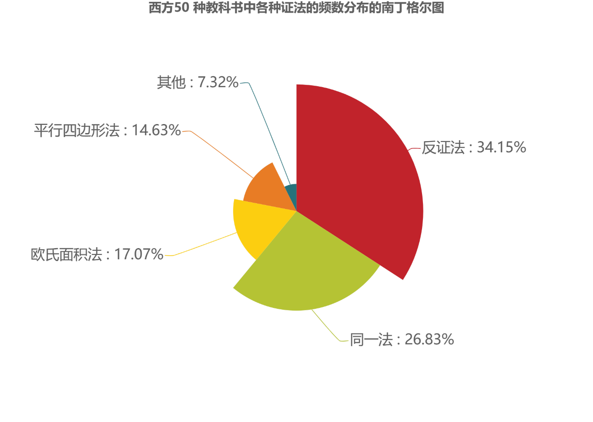

---

html:
    embed_local_images: true

---

<!-- Title : Markdown Template -->
<!-- Author : Albus Guo -->
<!-- Version : 0.1 -->
<!-- Update : 2023.2.4 -->

# 
三角形的中位线微课教学大纲

郭雨阳 江苏大学 数学与应用数学(师范)

顾佳伟 江苏大学 数学与应用数学(师范)

薛茹 江苏大学 数学与应用数学(师范)

## 
1 情境引入

&emsp;&emsp;逐步递进切蛋糕问题

&emsp;&emsp;如图,有一块三角形蛋糕,准备平分给四个小朋友,该怎样分呢?

&emsp;&emsp;1. 面积相等;
&emsp;&emsp;2. 全等.

## 
2 概念引入

### 2.1 给出中位线的定义 

&emsp;&emsp;**连接三角形两边中点的线段叫做三角形的中位线.**

&emsp;&emsp;结合图形进一步说明:

&emsp;&emsp;如图,在 $\triangle ABC$ 中, $D,E$ 分别是 $AB,AC$ 的中点,连接 $DE$ ,则线段 $DE$ 就称为 $\triangle ABC$ 的中位线.

### 2.2 探讨中位线有几条

&emsp;&emsp;结合定义,共3条.

### 2.3 探讨中位线定义的两层含义

## 
3 概念辨析

&emsp;&emsp;中位线与中线概念辨析

## 
4 定理探究

&emsp;&emsp;中位线与第三边的关系(数量、位置) $\rightarrow$ 提出猜想

## 
5 定理证明

&emsp;&emsp;完整讲解证明过程

延长 $DE$ 到 $F$ ,使 $EF=DE$ .连接 $CF$ ．

$\because\angle AED=\angle CEF,AE=CE$

$\therefore\triangle ADE\cong\triangle CFE$

$\therefore\angle ADE=\angle F,AD=CF$

$\therefore CF\mathrel{/\mskip-2.5mu/}AD,CF=AD,BD\mathrel{/\mskip-2.5mu/}CF,BD=CF$

$\therefore$ 四边形 $BCFD$ 是平行四边形

$\therefore DF\mathrel{/\mskip-2.5mu/}BC,DF=BC$

又 $DE=\dfrac{1}{2}DF$

$\therefore DE\mathrel{/\mskip-2.5mu/}BC,DE=\dfrac{1}{2}BC$

## 
6 定理总结

&emsp;&emsp;完整叙述定理

## 
7 主题升华

### 7.1 数学史

#### 7.1.1 古巴比伦泥版上的三角形分割问题

&emsp;&emsp;古巴比伦 DE 时期(公元前 1800-1600 年)的数学泥版 MLC 1950 (左图)上载有以下问题: 三角形的高为 50,用平行于底边的直线将其分割成高分别为 30 和 20 的小三角形和梯形,求原来的三角形以及分割得到的小三角形的底边.

&emsp;&emsp;这其实是现代的“平行线分线段成比例定理”的应用,用中位线来分割三角形,不过是其中特殊的问题而已.

#### 7.1.2 《几何原本》中的有关命题

&emsp;&emsp;公元前 3 世纪,古希腊数学家欧几里得在《几何原本》中并没有直接讨论中位线的性质,而是给出了更一般的命题:

&emsp;&emsp;**“将三角形两腰分割成成比例的线段,则分点连线段平行于三角形的底边.”**

&emsp;&emsp;欧几里得证明该定理的方法是:将线段之间的关系转化为三角形面积之间的关系,再将三角形面积之间的关系转化为直线的位置关系.这种方法同样适用于三角形中位线定理,如下:

如图所示,已知 $D,E$ 分别为 $AB,CD$ 的中点

由共边定理可得 $\dfrac{S_{\triangle ADE}}{S_{\triangle BDE}}=\dfrac{AD}{BD}=1\Rightarrow S_{\triangle ADE}=S_{\triangle BDE}$

同理可得 $S_{\triangle ADE}=S_{\triangle CDE}$

$\therefore S_{\triangle BDE}=S_{\triangle CDE}$

由共边三角形与平行线的关系可知 $BC\mathrel{/\mskip-2.5mu/}DE$

#### 7.1.3 刘徽对三角形面积公式的推导

&emsp;&emsp;中国汉代数学典籍《九章算术》方田章载有如下问题:

&emsp;&emsp;**“今有圭田广十二步,正从二十一步.问:为田几何?”“又有圭田广五步二分步之一,从八步三分步之二.问:为田几何?”**

&emsp;&emsp;书中给出的三角形面积公式是:

&emsp;&emsp;**“术曰:半广以乘正从.”**

&emsp;&emsp;这里,“广”就是三角形的底边,“正从”就是三角形的高.术文说的就是:三角形的面积等于底边的一半乘以高.刘徽注释说:

&emsp;&emsp;**“半广知,以盈补虚为直田也.亦可半正从以乘广.按半广乘从,以取中平之数,故广从相乘为积步.”**

&emsp;&emsp;这里,刘徽是通过割补的方法来推导三角形面积公式的:取三角形两腰的中点,过中点作底边的垂线,将垂线外侧的小三角形补到上方的相应位置(下左图),得到一个矩形,该矩形的面积等于原来的三角形的面积,它的长等于原三角形的高,它的宽等于原三角形底边的一半,即三角形面积等于半底乘以高.刘徽的第二种方法是:连接两腰中点(中位线),过顶点作中位线的垂线,将中位线上方的小三角形分割成两个小直角三角形,分别将它们补到相应位置(下右图),得到一个矩形,矩形的长为原三角形的底边长,宽为原三角形高的一半,故三角形的面积等于底乘以半高.

&emsp;&emsp;从三角形面积公式的推导过程可以看出,中国古代数学家知道中位线与底边的位置关系和大小关系.事实上,在下两图中,将中位线上方的两个小直角三角形分别补到相应位置时,所得到的四边形是矩形(因为一组对边平行且相等),故中位线与底边平行,且等于底边之半.

### 7.2 证明方法多样性

&emsp;&emsp;除了 `数学史` 所提到的方法外,还有苏格兰数学家莱斯利用到的欧氏面积法、法国数学家勒让德的反证法等等.下图给出了 50 种教科书中各种证法的频数分布:

&emsp;&emsp;这说明,数学定理的证明方法多种多样,古今中外,源远流长,因此学习数学一定要开拓思维,多学习各种不同的思想,站在巨人的肩膀上纵观整个数学世界. 

